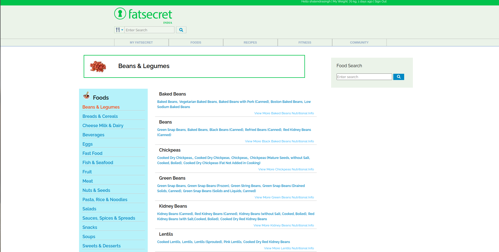
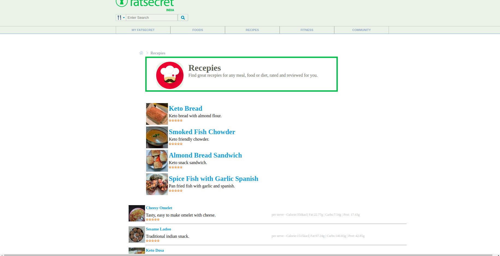
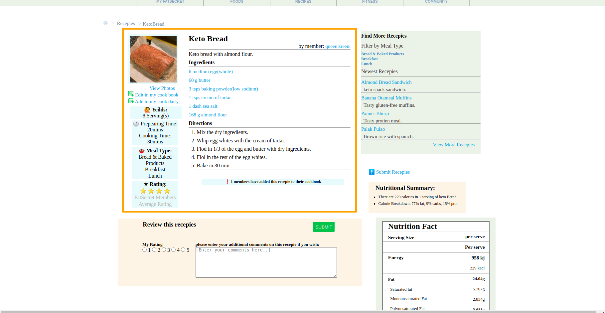
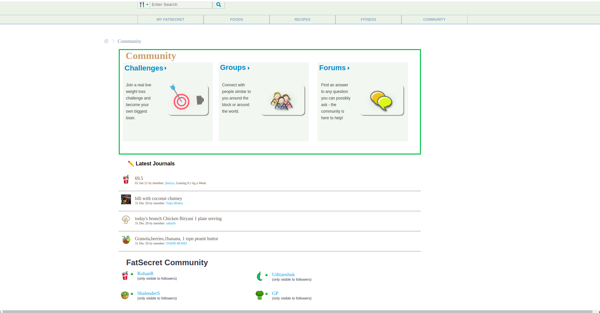

# Team Vanadium

## Project Title :- FatSecret.com

#### FatSecret is a mobile application, website and API that lets users track their nutrition, exercise and weight.

## Technologies Used

<ul>
<li>HTML
<li>CSS
<li>Javascript
</ul>

### Index Page

<ul>
<li>Overview of the FatSecret.
<li>FatSecret is a mobile application, website and API that lets users track their nutrition, exercise and weight.
  Find great meal ideas, diet tools, community support and more as you discover a world of healthy eating at fatsecret.com.
</ul>

 <h1></h1>

### Food page

<ul>
<li>This page will show the veraity of food to know different plans for Personal Diet.
<li>In personal Diet are helps us to be fell healthy and fresh.In this section  you can see and make a proper diet anytime.
</ul>

<h1></h1>

### Food Menu Page List

<ul>
<li>This page will help to know about food and details.

</ul>

<h1></h1>

### Food Nutritional Details

<ul>
<li>See details about food on this page.
</ul>

<ul>
<li>Recepie Page, review recepies</li>
</ul>

<ul>
<li>Recepies details page.
</ul>

<ul>
<li>After cook upload pic..
</ul>

<ul>
<li>Community Page.
</ul>

<ul>
<li>Community Member Page.
</ul>

👤 Rohan Ranjan

 <ul>
 <li>Github : rohanranjan25061996 
 <li>Email : ranjanrohan96@gmail.com
 </ul>

 <h1></h1>

<h1></h1>
👤 Shalendra Singh

 <ul>
 <li>Github : shalendrasingh
 <li>Email : shalendrasingh.aec@gmail.com
 </ul>
<h1></h1>
👤 Uditanshu Kumar

 <ul>
 <li>Github : udit22022000
 </ul>

<h1></h1>
